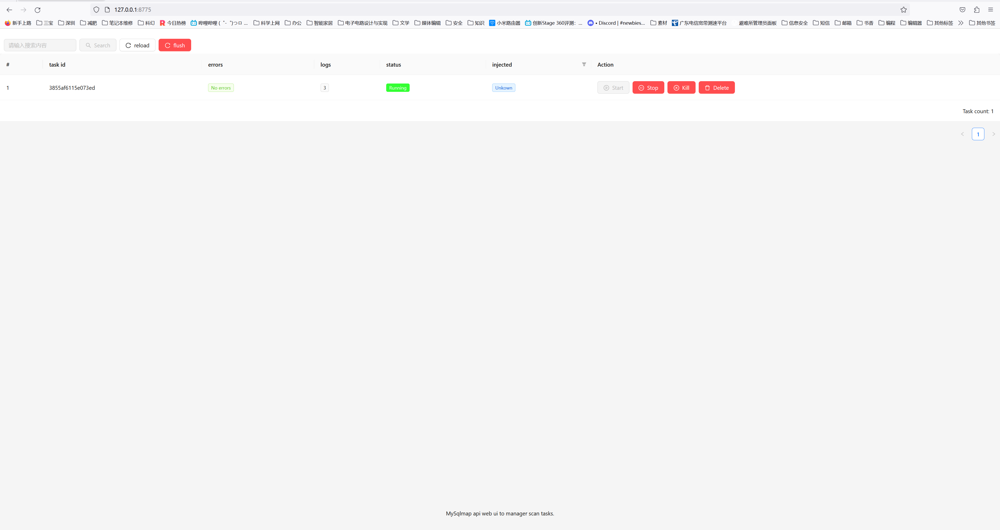
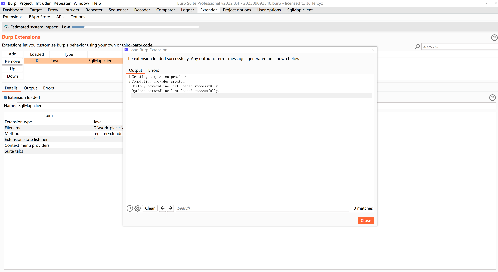
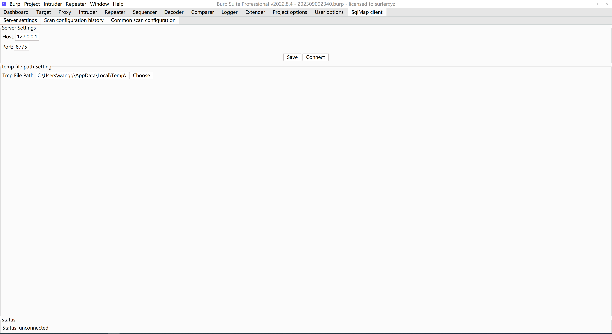
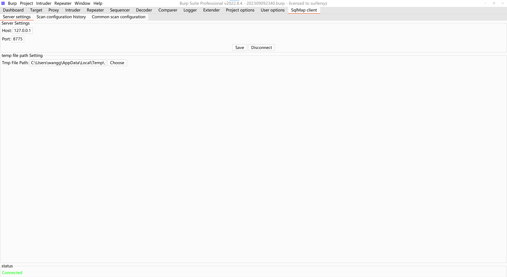
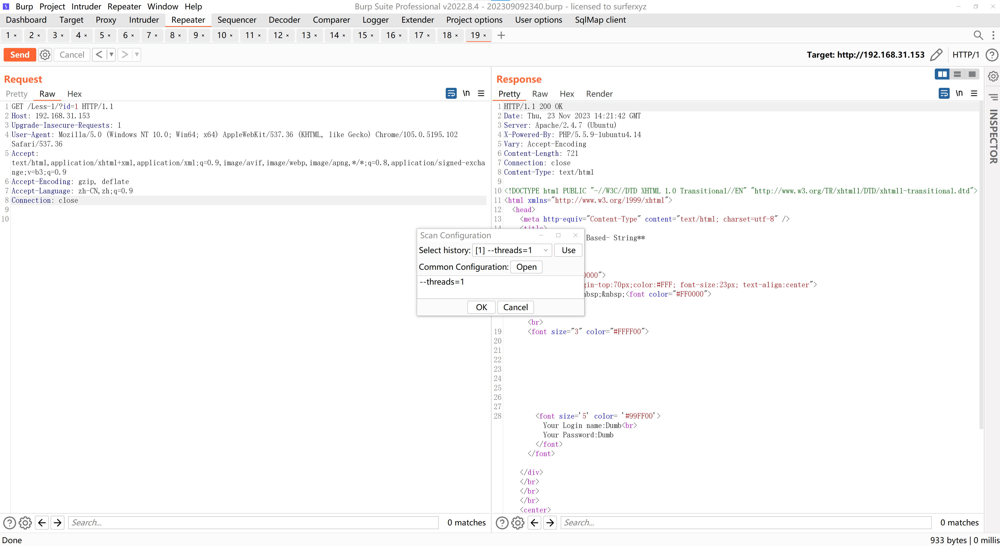

# mySqlmapp - base on sqlmap and scan task manager web ui Injection Scanner

mySqlmapp is a forked and modified version of sqlmap, a popular SQL injection scanner. This fork aims to enhance the functionality of sqlmap by adding web-based task management capabilities. It allows users to manage their scanning tasks directly through a web interface, providing features such as task activation, pausing, termination, and deletion. Additionally, users can view task logs, identify injection points, and easily access payload details.

We have also developed a Java-based Burp Suite client plugin that simplifies the process of submitting scanning tasks. This plugin seamlessly integrates with Burp Suite, enabling users to submit tasks directly from within the application.

## Features

- Web-based task management: Easily manage SQL injection scanning tasks through a user-friendly web interface.
- Task control: Start, pause, terminate, and delete scanning tasks as needed.
- Task logs: View detailed logs for each scanning task, allowing for effective troubleshooting and analysis.
- Injection point identification: Clearly identify injection points in the scanned application.
- Payload details: Conveniently access and review payload details for each injection point.
- Burp Suite integration: Utilize our Java-based Burp Suite client plugin to streamline the submission of scanning tasks.

## Installation

To get started with mySqlmap, follow these steps:

### 1. Clone the mySqlmap repository from GitHub:
```shell
git clone https://github.com/yourusername/mySqlmap.git
```
### 2. Ensure that you have Python [3.7+] installed.

### 3. Configuring the Web-Based Task Management Interface  

#### 3.1. Open a command prompt or terminal and navigate to the root directory of the project. 

#### 3.2. Execute the following command to start the mySqlmap API server:
```shell
python sqlmapapi.py -s
```  

#### 3.3. Once the server is running, open a web browser (Google Chrome is recommended) and enter the following URL:[mySqlmap web ui： http://127.0.0.1:8775](http://127.0.0.1:8775)  

#### 3.4. The web-based task management interface will be displayed in your browser. From there, you can manage and monitor your SQLMap tasks conveniently.


> Please note that the SQLMap API server needs to be running in order to access the web-based management interface.   
> Make sure to keep the server running while using the interface.


### 4. The Burp Suite client plugin.]
#### 4.1. download the plugin from github repository: [mySqlmapClient](https://github.com/GitHubNull/mySqlmapClient)
#### 4.2. install the plugin in Burp Suite:

#### 4.3. configure the plugin:
##### 4.3.1. open the plugin configuration page:
 
##### 4.3.2. enter the SQLMap API server address(or left default) and 
##### 4.3.3. enter the SQLMap API server port(or left default)
##### 4.3.4. enter the SQLMap API tmp request file dir(or left default)
##### 4.3.5. click connect button to connect to mySqlmap api service
##### 4.3.6. click save button to save the configuration

 

#### 4.4. use plugin:
  


Sub repository
----
* [mySqlmapClient](https://github.com/GitHubNull/mySqlmapClient)
* [mySqlmapWebTaskManager](https://github.com/GitHubNull/mySqlmapWebTaskManager)

## Contributing

We welcome contributions from the community to enhance the functionality and usability of mySqlmap. If you would like to contribute, please follow these guidelines:

1. Fork the repository and create a new branch for your feature or bug fix.

2. Ensure that your code adheres to the existing coding style and conventions.

3. Test your changes thoroughly.

4. Submit a pull request, describing the purpose and changes introduced by your contribution.


Translations
----
* [Chinese](https://github.com/GitHubNull/mySqlmap/blob/master/doc/translations/README-zh-CN.md)

## License

mySqlmap is released under the [license] license. Please review the [LICENSE](/LICENSE) file for more details.

## Disclaimer

mySqlmap is a tool designed for legitimate security testing purposes. However, it is essential to obtain proper authorization before scanning any system or application. The authors of mySqlmap are not responsible for any misuse or illegal activities conducted with this tool.

## Contact

If you have any questions, suggestions, or feedback, please contact [github address].

Thank you for using mySqlmap! We hope it helps you in your SQL injection testing endeavors.