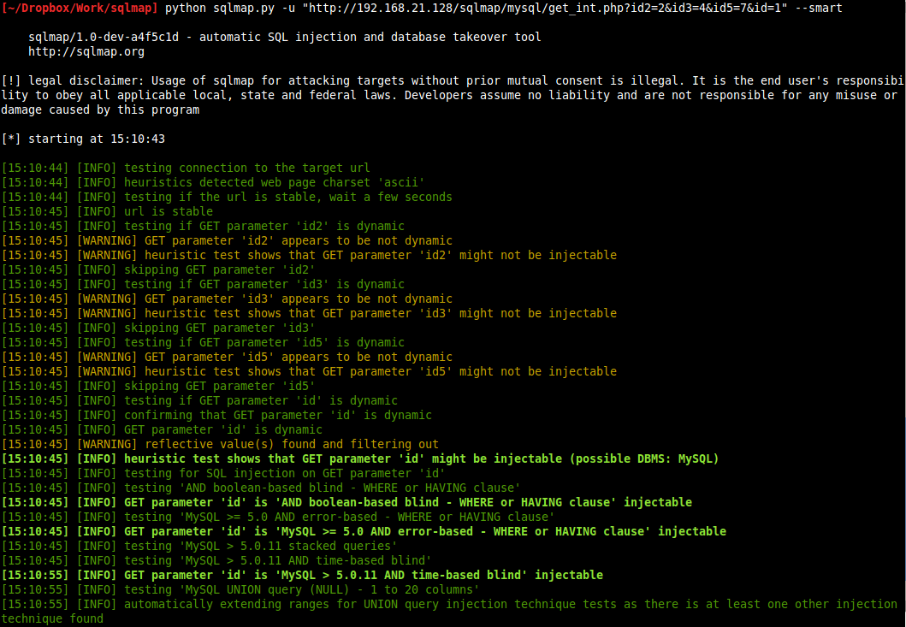
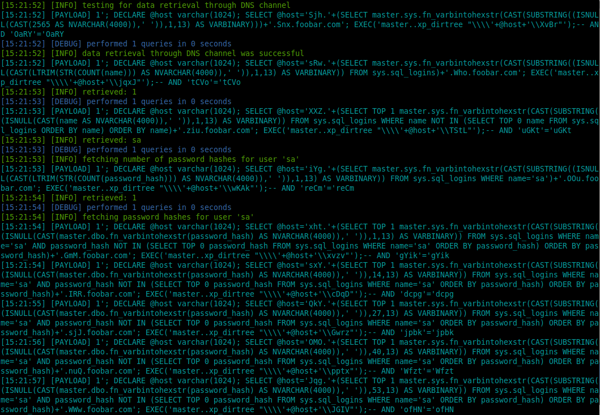
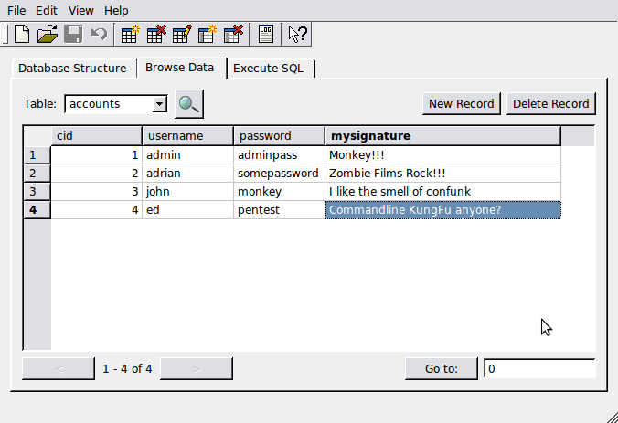
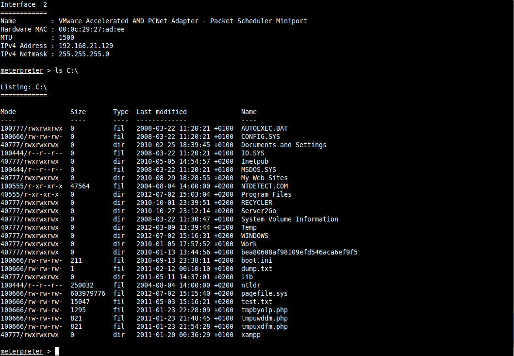
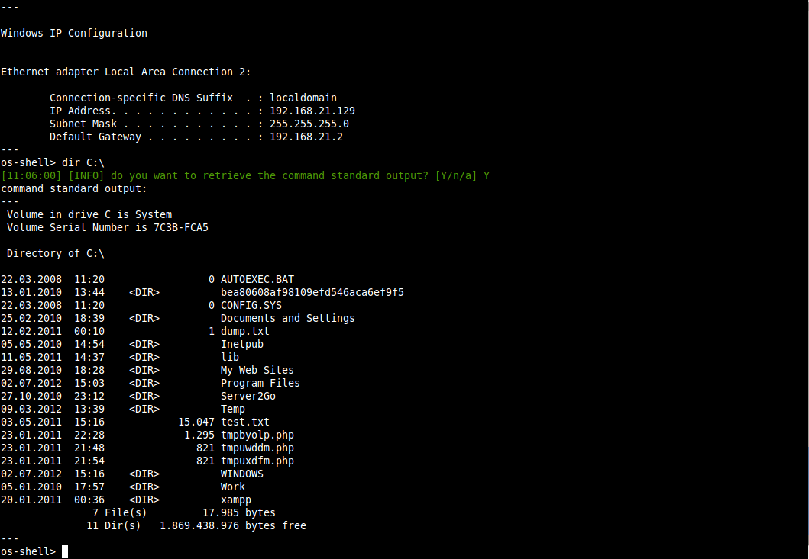
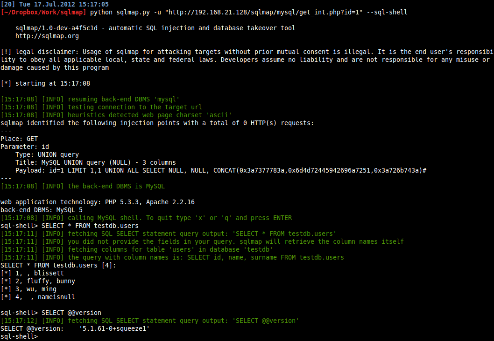

# Screenshots

Verbose output (option `-v` set to `3`):

Concatenation of three tamper scripts to obfuscate the injected SQL payloads (switch `--tamper`):

Cracking dumped databased users' password hashes (switch `--passwords`):

Enumerating database table's columns (switch `--columns`):

Mnemonics (option `-z` set to `"flu,ign,bat,tec=B"`):

Conducting through tests only if positive heuristic(s) (switch `--smart`):

DNS exfiltration technique (option `--dns-domain`):

Replicating table to a local SQLite3 database (switch `--replicate`):

OS pwn mode (Meterpreter) (switch `--os-pwn`):

OS shell mode (switch `--os-shell`):

SQL shell mode (switch `--sql-shell`):

Wizard mode (switch `--wizard`):

