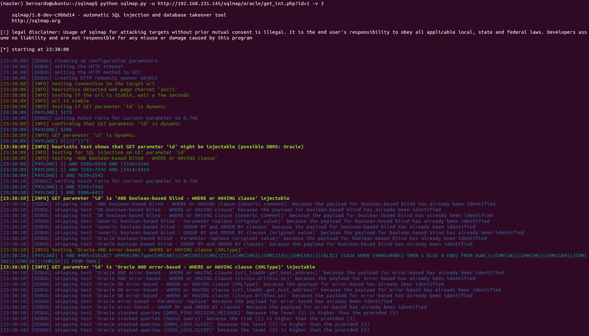
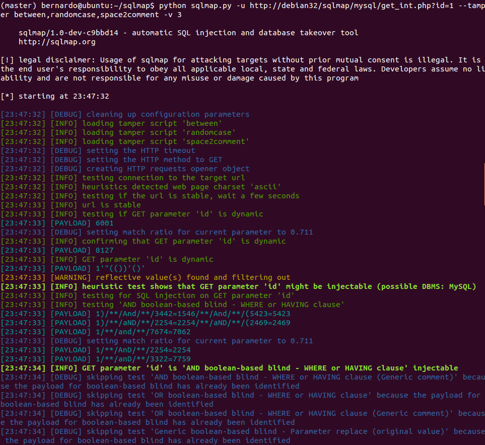
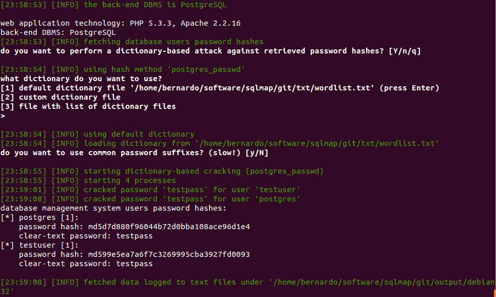
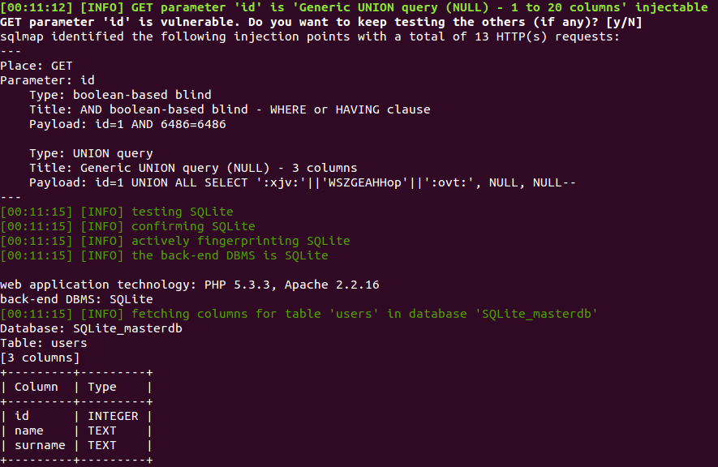
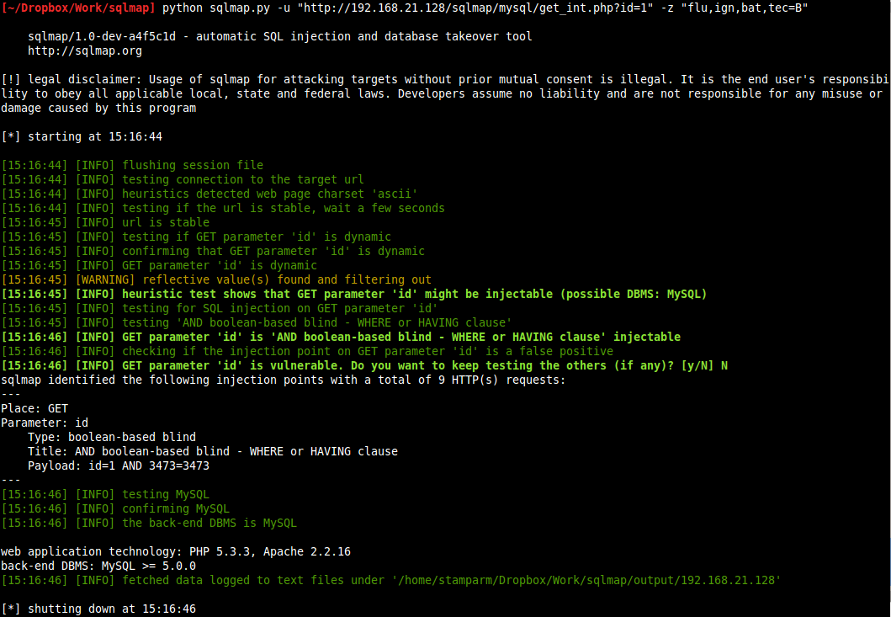
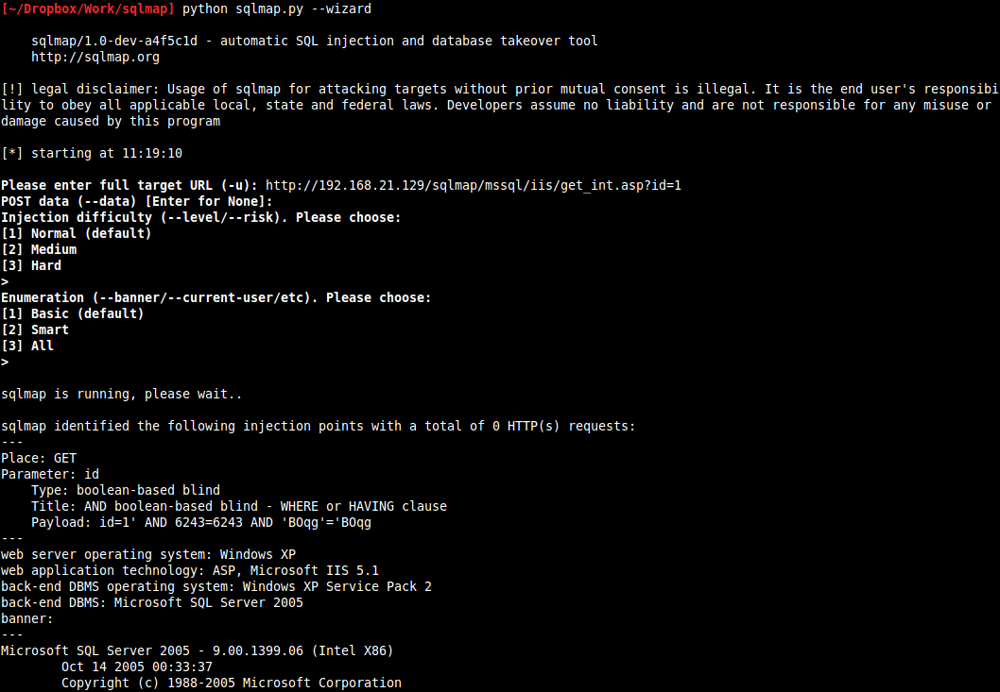

# Screenshots

Verbose output (option `-v` set to `3`):

Concatenation of three tamper scripts to obfuscate the injected SQL payloads (switch `--tamper`):

Cracking dumped databased users' password hashes (switch `--passwords`):

Enumerating database table's columns (switch `--columns`):

Mnemonics (option `-z` set to `flu,ign,bat,tec=B`):

SQL shell mode (switch `--sql-shell`):

Wizard mode (switch `--wizard`):

